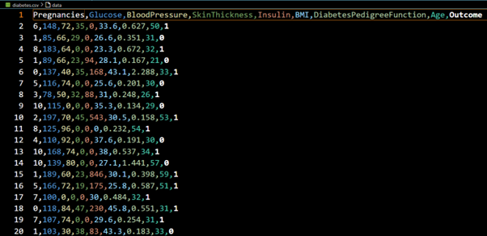

# Diabetes Prediction Model

A machine learning project to predict whether a patient is diabetic or not, using the **Random Forest Classifier** and an interactive web app built with **Streamlit**.

---

## **Project Description**
This project predicts diabetes based on medical diagnostic data like glucose level, BMI, blood pressure, and more.  
We chose the **Random Forest Classifier** for its robustness and high accuracy in classification tasks.

The model is deployed using Streamlit to provide an easy-to-use web interface for users to input data and get predictions.

---

## **Dataset**
We used the [Pima Indians Diabetes Dataset](https://www.kaggle.com/datasets/uciml/pima-indians-diabetes-database) originally collected by the National Institute of Diabetes and Digestive and Kidney Diseases.

- Total records: **768**
- Input features: **8**
- Output: Binary (1 = diabetic, 0 = non-diabetic)

**Features:**
- Pregnancies
- Glucose
- BloodPressure
- SkinThickness
- Insulin
- BMI
- DiabetesPedigreeFunction
- Age

---

## ⚙ **Machine Learning Model**
- **Model:** Random Forest Classifier (`n_estimators=100`)
- **Preprocessing:**
  - Handled missing values (e.g., zeros in insulin)
  - Feature scaling using `StandardScaler`
- **Evaluation Metrics:**
  - Accuracy
  - Confusion Matrix
  - ROC Curve

**Why Random Forest?**
- Handles non-linear data effectively
- Reduces overfitting through ensembling
- Provides feature importance

---

## **Performance**
- Slightly imbalanced dataset (500 non-diabetic vs. 268 diabetic)
- Evaluated using accuracy and ROC curve
- Confusion matrix clearly shows true/false positives and negatives

---

## **Deployment**
The model is deployed with **Streamlit**, allowing users to:
- Enter medical data through a simple web interface
- Instantly see diabetes predictions

---

## **Screenshots**

### Dataset preview

### Data distribution plot

### Confusion matrix

### ROC curve

---

## **References**
- [Kaggle Dataset](https://www.kaggle.com/datasets/uciml/pima-indians-diabetes-database)

---

